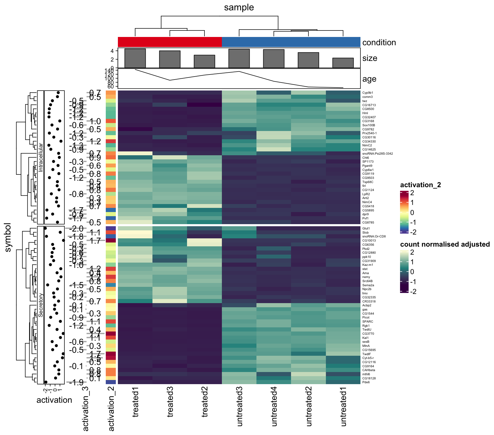

The tidyHeatmap package
================
Stefano Mangiola
2025-01-26

<!-- badges: start -->

[](https://lifecycle.r-lib.org/articles/stages.html)
[](https://doi.org/10.21105/joss.02472)
<!-- badges: end -->

`tidyHeatmap` is a package that introduces tidy principles to the
creation of information-rich heatmaps. This package uses
[ComplexHeatmap](https://bioconductor.org/packages/release/bioc/html/ComplexHeatmap.html)
as graphical engine.

## Citation

Mangiola et al., (2020). tidyHeatmap: an R package for modular heatmap
production based on tidy principles. Journal of Open Source Software,
5(52), 2472, <https://doi.org/10.21105/joss.02472>

Please have a look also to

- [tidygate](https://github.com/stemangiola/tidygate/) for adding custom
  gate information to your tibble
- [tidySingleCellExperiment](https://stemangiola.github.io/tidySingleCellExperiment/)
  for tidy manipulation of Seurat objects
- [tidyseurat](https://stemangiola.github.io/tidyseurat/) for tidy
  manipulation of Seurat objects
- [tidybulk](https://stemangiola.github.io/tidybulk/) for tidy
  high-level data analysis and manipulation
- [tidySummarizedExperiment](https://stemangiola.github.io/tidySummarizedExperiment/)
  for heatmaps produced with tidy principles

## Full documentation [here](https://stemangiola.github.io/tidyHeatmap/articles/introduction.html)

``` r
# Create some more data points
pasilla_plus <- 
	tidyHeatmap::pasilla |>
	dplyr::mutate(activation_2 = activation, activation_3 = activation) |> 
	tidyr::nest(data = -sample) |>
	dplyr::mutate(size = rnorm(n(), 4,0.5)) |>
	dplyr::mutate(age = runif(n(), 50, 200)) |>
	tidyr::unnest(data) 

# Plot
pasilla_plus |>
	heatmap(
		.column = sample,
		.row = symbol,
		.value = `count normalised adjusted`,	
		scale = "row"
	) |>
	annotation_tile(condition) |>
	annotation_point(activation) |>
	annotation_numeric(activation_3) |>
	annotation_tile(activation_2) |>
	annotation_bar(size) |>
	annotation_line(age)
```



**Advantages:**

- Modular annotation with just specifying column names
- Custom grouping of rows is easy to specify providing a grouped tbl.
  For example `df |> group_by(...)`
- Labels size adjusted by row and column total number
- Default use of Brewer and Viridis palettes

## Functions/utilities available

| Function             | Description                                                                 |
|----------------------|-----------------------------------------------------------------------------|
| `heatmap`            | Plots base heatmap                                                          |
| `group_by`           | `dplyr` function - groups heatpmap rows/columns                             |
| `annotation_tile`    | Adds tile annotation to the heatmap                                         |
| `annotation_point`   | Adds point annotation to the heatmap                                        |
| `annotation_bar`     | Adds bar annotation to the heatmap                                          |
| `annotation_numeric` | Adds bar + number annotation to the heatmap                                 |
| `annotation_line`    | Adds line annotation to the heatmap                                         |
| `layer_text`         | Add layer of text on top of the heatmap                                     |
| `layer_point`        | Adds layer of symbols on top of the heatmap                                 |
| `layer_square`       | Adds layer of symbols on top of the heatmap                                 |
| `layer_diamond`      | Adds layer of symbols on top of the heatmap                                 |
| `layer_arrow_up`     | Adds layer of symbols on top of the heatmap                                 |
| `layer_arrow_down`   | Add layer of symbols on top of the heatmap                                  |
| `layer_star`         | Add layer of symbols on top of the heatmap                                  |
| `layer_asterisk`     | Add layer of symbols on top of the heatmap                                  |
| `split_rows`         | Splits the rows based on the dendogram                                      |
| `split_columns`      | Splits the columns based on the dendogram                                   |
| `save_pdf`           | Saves the PDF of the heatmap                                                |
| `+`                  | Integrate heatmaps side-by-side                                             |
| `as_ComplexHeatmap`  | Convert the tidyHeatmap output to ComplexHeatmap for non-standard “drawing” |
| `wrap_heatmap`       | Allows the integration with the `patchwork` package                         |

## Installation

To install the most up-to-date version

``` r
devtools::install_github("stemangiola/tidyHeatmap")
```

To install the most stable version (however please keep in mind that
this package is under a maturing lifecycle stage)

``` r
install.packages("tidyHeatmap")
```

## Contribution

If you want to contribute to the software, report issues or problems
with the software or seek support please open an issue
[here](https://github.com/stemangiola/tidyHeatmap/issues)
