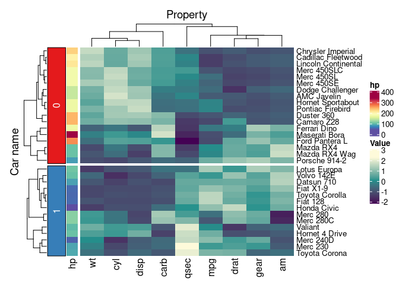
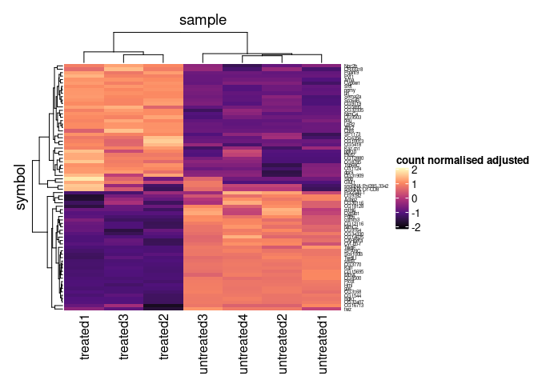
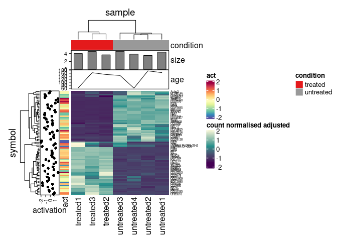

tidyHeatmap
================

<!-- badges: start -->

[](https://www.tidyverse.org/lifecycle/#maturing)
<!-- badges: end -->

Please have a look also to -
[nanny](https://github.com/stemangiola/nanny) for tidy high-level data
analysis and manipulation -
[tidygate](https://github.com/stemangiola/tidygate) for adding custom
gate information to your tibble -
[tidybulk](https://github.com/stemangiola/tidybulk) for tidy and modular
transcriptomics analyses

website: [stemangiola.github.io/tidyHeatmap/](https://stemangiola.github.io/tidyHeatmap/)

`tidyHeatmap` is a package that introduces tidy principles to the
creation of information-rich heatmaps. This package uses
[ComplexHeatmap](https://bioconductor.org/packages/release/bioc/html/ComplexHeatmap.html)
as graphical engine.

**Advantages:**

  - Modular annotation with just specifying column names
  - Custom grouping of rows is easy to specify providing a grouped tbl.
    For example `df %>% group_by(...)`
  - Labels size adjusted by row and column total number
  - Default use of Brewer and Viridis palettes

## Functions/utilities available

| Function    | Description                         |
| ----------- | ----------------------------------- |
| `heatmap`   | Plot base heatmap                   |
| `add_tile`  | Add tile annotation to the heatmap  |
| `add_point` | Add point annotation to the heatmap |
| `add_bar`   | Add bar annotation to the heatmap   |
| `add_line`  | Add line annotation to the heatmap  |
| `save_pdf`  | Save the PDF of the heatmap         |

## Installation

To install the most up-to-date version

``` r
devtools::install_github("stemangiola/tidyHeatmap")
```

To install the most stable version (however please keep in mind that
this package is under a maturing lifecycle stage)

``` r
install.packages("tidyHeatmap")
```

## Contribution

If you want to contribute to the software, report issues or problems
with the software or seek support pleae open an issue
[here](https://github.com/stemangiola/tidyHeatmap/issues)

## Input data frame

``` r
library(dplyr)
```

    ## 
    ## Attaching package: 'dplyr'

    ## The following objects are masked from 'package:stats':
    ## 
    ##     filter, lag

    ## The following objects are masked from 'package:base':
    ## 
    ##     intersect, setdiff, setequal, union

``` r
library(tidyr)
library(tidyHeatmap)
```

    ## 
    ## Attaching package: 'tidyHeatmap'

    ## The following object is masked from 'package:stats':
    ## 
    ##     heatmap

``` r
mtcars_tidy = 
    mtcars %>% 
    as_tibble(rownames="Car name") %>% 
    
    # Scale
    mutate_at(vars(-`Car name`, -hp, -vs), scale) %>%
    
    # tidyfy
    gather(Property, Value, -`Car name`, -hp, -vs)
```

    ## Warning: attributes are not identical across measure variables;
    ## they will be dropped

``` r
mtcars_tidy
```

    ## # A tibble: 288 x 5
    ##    `Car name`           hp    vs Property  Value
    ##    <chr>             <dbl> <dbl> <chr>     <dbl>
    ##  1 Mazda RX4           110     0 mpg       0.151
    ##  2 Mazda RX4 Wag       110     0 mpg       0.151
    ##  3 Datsun 710           93     1 mpg       0.450
    ##  4 Hornet 4 Drive      110     1 mpg       0.217
    ##  5 Hornet Sportabout   175     0 mpg      -0.231
    ##  6 Valiant             105     1 mpg      -0.330
    ##  7 Duster 360          245     0 mpg      -0.961
    ##  8 Merc 240D            62     1 mpg       0.715
    ##  9 Merc 230             95     1 mpg       0.450
    ## 10 Merc 280            123     1 mpg      -0.148
    ## # … with 278 more rows

## Plot

For plotting, you simply pipe the input data frame into heatmap,
specifying:

  - The rows, cols relative column names (mandatory)
  - The value column name (mandatory)
  - The annotations column name(s)

mtcars

``` r
mtcars_heatmap = 
    mtcars_tidy %>% 
        heatmap(`Car name`, Property, Value ) %>%
        add_tile(hp)

mtcars_heatmap
```

<!-- -->

## Save

``` r
mtcars_heatmap %>% save_pdf("mtcars_heatmap.pdf")
```

## Grouping

We can easily group the data (one group per dimension maximum, at the
moment only the vertical dimension is supported) with dplyr, and the
heatmap will be grouped accordingly

``` r
mtcars_tidy %>% 
    group_by(vs) %>%
    heatmap(`Car name`, Property, Value ) %>%
    add_tile(hp)
```

<!-- -->

## Custom palettes

We can easily use custom palette, using strings, hexadecimal color
character vector,

``` r
mtcars_tidy %>% 
    heatmap(
        `Car name`, 
        Property, 
        Value,
        palette_value = c("red", "white", "blue")
    )
```

<!-- -->

Or a grid::colorRamp2 function for higher flexibility

``` r
mtcars_tidy %>% 
    heatmap(
        `Car name`, 
        Property, 
        Value,
        palette_value = circlize::colorRamp2(c(-2, -1, 0, 1, 2), viridis::magma(5))
    )
```

<!-- -->

## Multiple groupings and annotations

``` r
tidyHeatmap::pasilla %>%
    group_by(location, type) %>%
    heatmap(
            .column = sample,
            .row = symbol,
            .value = `count normalised adjusted`
        ) %>%
    add_tile(condition) %>%
    add_tile(activation)
```

<!-- -->

## Annotation types

**This feature requires \>= 0.99.20 version**

“tile” (default), “point”, “bar” and “line” are available

``` r
# Create some more data points
pasilla_plus = 
    tidyHeatmap::pasilla %>%
        dplyr::mutate(act = activation) %>% 
        tidyr::nest(data = -sample) %>%
        dplyr::mutate(size = rnorm(n(), 4,0.5)) %>%
        dplyr::mutate(age = runif(n(), 50, 200)) %>%
        tidyr::unnest(data) 

# Plot
pasilla_plus %>%
        heatmap(
            .column = sample,
            .row = symbol,
            .value = `count normalised adjusted`
        ) %>%
    add_tile(condition) %>%
    add_point(activation) %>%
    add_tile(act) %>%
    add_bar(size) %>%
    add_line(age)
```

<!-- -->
