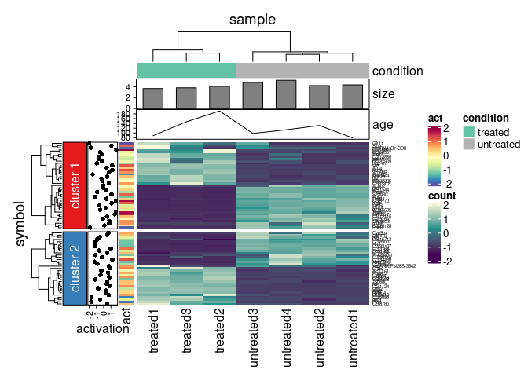

# Background
The heatmap is a powerful tool for visualising multi-dimensional data, where individual values can be organised in a two-dimensional matrix and their values expressed as colours. Rows and columns can be ordered according to their reciprocal similarity using hierarchical clustering; and dendrograms can be added to the plot to facilitate the interpretation. Row- and column-wise visual annotations, such as coloured tiles, can also be included. Within the R environment, several packages have been developed to produce heatmaps. The simplest and most readily available tool, `heatmap`, is provided within the `stats` package [@RCoreTeam:2013] and offers basic heatmaps with simple tile annotations. The versatile package `ggplot2` can be also used to produce basic heatmaps [@Hadley:2016]. More powerful software exists for producing fully annotated and/or multi-panel heatmaps, such as `Pheatmap` [@Kolde2012-tu], `superheat` [@superheatmap] and `ComplexHeatmap` [@Gu2016-cd]. The versatility of these packages comes at the cost of adding complexity in the user interface, characterised by many parameters and annotation functions that introduce a steep learning curve to produce complex, clear, and good-looking graphics.

Recently, efforts have been made toward the harmonisation of data frame structures and data analysis workflows using the concept of tidiness. Tidy data frames are characterised by having a specific structure where each variable is a column and each observation is a row. They provide ease of manipulation, modelling, and visualisation. The `tidyverse` is a suite of R libraries that defined the standard for tidy data and APIs [@Hadley:2019]. The unique correspondence between quantities and annotations, characteristic of tidy data frames, allows complex operations to be performed from simple user inputs, such as a list of column names. 

# Statement of need
Considering (i) the utility and complexity of creating information-rich heatmaps, and (ii) the opportunity of increased coding efficiency and robustness offered by the tidy paradigm, a bridge between the two is very much needed. Recently, many tools for data science have been implemented according with tidy principles, this package aims to fill the gap for one of the most used data explorations tool.

# Tidy paradigm for visualisation
`tidyHeatmap` is a graphical R package that introduces tidy principles to the creation of information-rich heatmaps. It is available in the CRAN R repository. This package currently uses `ComplexHeatmap` as its graphical engine; however, due to its modular design it can be readily expanded to interface other engines. The command-line user interface is organised into (i) a main plotting utility; (ii) annotation layer utilities; and (iii) file-output utilities. The input is a tidy data frame with element (e.g. person), feature (e.g. physical characteristics) and value column, with additional column for independent variables for either elements (e.g. number of sport medals) or features (e.g. macroscopic or molecular characteristics). In this data structure, each observation is an element-feature pair. 

| element         | feature         | value     | annotation | group |
| --------------- | --------------- | --------- | ---------- | ----- |
| `chr` or `fctr` | `chr` or `fctr` | `numeric` | …          | …     |

The input data frame streams along the utility path using the pipe operator from `magrittr`, allowing high modularity. The main utility allows the user to plot a base heatmap with dendrograms. The annotation utilities allow to serially add tile, point, bar and/or line annotation boxes to the side of the heatmap. The orientation of the annotations (row- or column-wise) is inferred based on the input data frame. The file-output utility allows the user to save vector or bitmap images directly from the R object, in the style of `ggplot2`. Row- or column-wise clusters can be defined effortlessly by applying the `group_by` function from `dplyr` [@Hadley:2020] to the input data frame. Data transformation and row/column scaling is done internally. Together, this leads to a decrease of coding burden of 3 and 5 folds for lines and characters respectively compared to `ComplexHeatmap` (e.g., for \autoref{fig:example}). Besides offering a modular and user-friendly interface, `tidyHeatmap` applies publication-ready aesthetics such as `viridis` [@Garnier:2018] and `brewer` [@Neuwirth:2014] colour palettes and automatic sizing of row and column labels to avoid overlapping (\autoref{fig:example}). 



The code interface consists of modular functions linked through the pipe operator. Custom colour palettes can be used by passing an array of colours or a colour function (e.g., circlize [@Zuguang:2014]) to the palette argument of the annotation utilities.

```r
my_heatmap = 

	# Grouping
	input_df %>%
	group_by(pathway) %>%
		
	# Plotting
	heatmap(feature, element, value) %>%
    
	# Annotation
	add_tile(condition) %>%
	add_tile(act) %>%
	add_point(activation) %>%
	add_bar(size) %>%
	add_line(age)

# Saving
my_heatmap %>% save_pdf("my_file.pdf")
```

# Conclusions
In order to perform complex tasks, the use of disjointed data structures demands time consuming and bug-prone information matching. Joint, tidy data frames decrease the cost/benefit ratio for the user, automating a large part on the data manipulation. `tidyHeatmap` introduces a modular paradigm for specifying information-rich heatmaps, just requiring column names as input. Due to its intuitive user interface and its advanced default aesthetic features, `tidyHeatmap` is ideal for the quick production of publication-ready heatmaps. This software is designed for modular expandability. Future directions include the incorporation of more static and interactive heatmap visualisation engines.

# Acknowledgements

We acknowledge contributions all the Papenfuss Lab for feedback, and Maria Doyle for constant support.

# References
